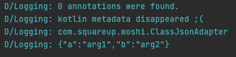
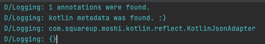
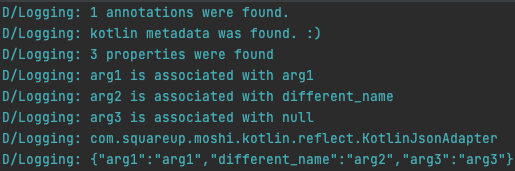

※ https://eaglesakura.hatenablog.com/entry/2021/12/09/165209 用の調査

It seems R8 eliminates Kotlin Metadata unexpectedly for Kotlin 1.6.0. This occurs crashes and/or unexpected behaviours for libraries that rely on Kotlin Metadata like Moshi.

R8 version (corresponding AGP version) | Work? | Note
:-----|:-----|:----
3.0.73 (7.0.4) | :x: | kotlin metadata was not found so Moshi couldn't use KotlinJsonAdapter
3.0.78 (?) | :x: | ditto. (The latest of R8 3.0.x)
3.1.30 (7.1.0-beta04) | :x: | No crash happened but bindings are wrong.
3.1.46 (?) | :x: | ditto (The latest of R8 3.1.x)
3.2.31 (?) | :white_check_mark: | The latest of R8 3.2.x
8470bf (?) | :white_check_mark: | HEAD of main branch

Logs

3.0.73, 3.0.78 | 3.1.30, 3.1.46 | 8470bf
:---|:----|:---
||