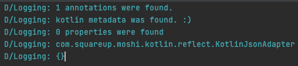

※ https://eaglesakura.hatenablog.com/entry/2021/12/09/165209 用の調査

Kotlin 1.6.0 + Moshi Reflection + R8 

R8 version | Work? | Note
:-----|:-----|:----
3.0.73 (AGP 7.0.4) | :x: | kotlin metadata was not found so Moshi couldn't use KotlinJsonAdapter
3.0.78 (The latest of 3.0.x) | :x: | No crash happened but member properties are missing.
3.1.30 (AGP 7.1.0-beta04) | :x: | ditto.
3.1.46 (The latest of 3.1.x) | :x: | ditto.
3.2.31 (The latest of 3.2.x) | :white_check_mark: | N/A
8470bf (HEAD of main) | :white_check_mark: | N/A

Logs

3.0.73 | 3.0.78, 3.1.30, 3.1.46 | 3.2.31, 8470bf, and AGP 4.2.2 w/ Kotlin 1.5.30
:---|:----|:---
||