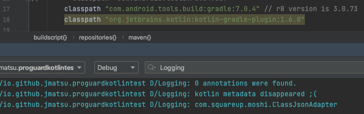
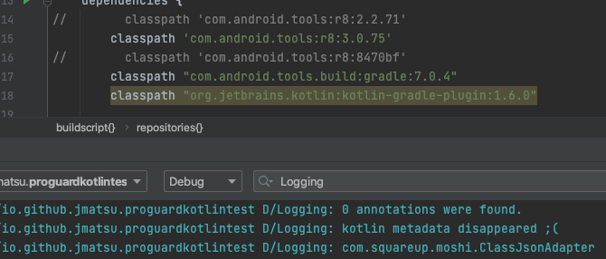
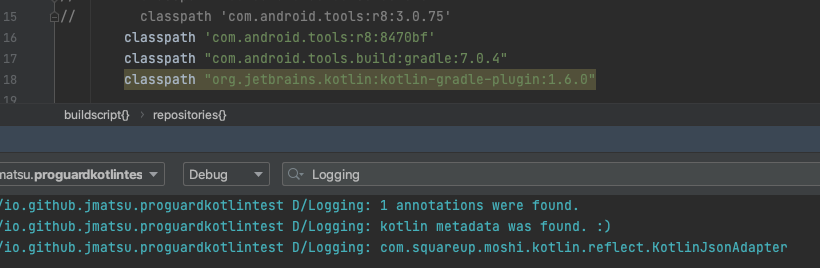

※ https://eaglesakura.hatenablog.com/entry/2021/12/09/165209 用の調査

It seems R8 eliminates Kotlin Metadata unexpectedly for Kotlin 1.6.0. This occurs crashes and/or unexpected behaviours for libraries that rely on Kotlin Metadata like Moshi.

R8 version (corresponding AGP version) | Work? | Note
2.2.71 (4.2.2) | :x: | kotlin metadata could be found but app crashed due to accessing missing properties
3.0.73 (7.0.4) | :x: | kotlin metadata was not found so Moshi couldn't use KotlinJsonAdapter
3.0.75 (?) | :x: | ditto
8470bf (?) | :white_check_mark: | HEAD of main branch at Dec 12. [https://r8.googlesource.com/r8/+/8470bf53e47d6b42b89b7ef31015002869a283e5](https://r8.googlesource.com/r8/+/8470bf53e47d6b42b89b7ef31015002869a283e5)

